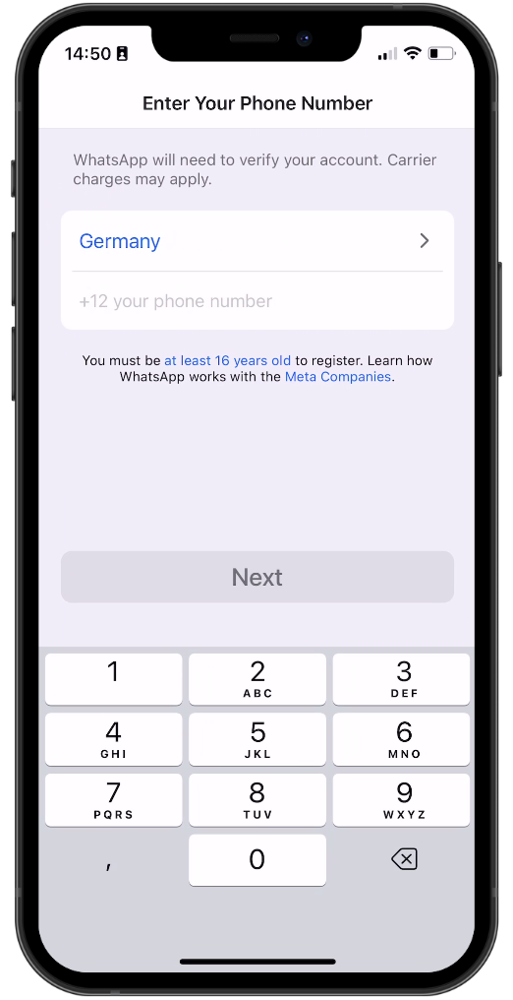

# React Native WhatsApp Clone with Clerk

It looks like you've shared a piece of code written in TypeScript using React Native, Expo, and other related libraries. Let me break down the key components and features in the provided code:

# Imported Libraries:

@expo/vector-icons: Used for importing icon sets (FontAwesome and Ionicons) for UI components.
expo-font: Provides a hook (useFonts) for loading custom fonts.
expo-router: A routing library for Expo projects.
expo-splash-screen: Used for preventing the splash screen from auto-hiding before asset loading is complete.
@clerk/clerk-expo: Integration for using Clerk authentication in Expo projects.
expo-secure-store: Provides a secure store for sensitive information.
react and react-native: Core libraries for React and React Native development.
# Clerk Integration:

The code integrates Clerk authentication using ClerkProvider. The Clerk provider is set up with a publishable key and a token cache using expo-secure-store.
# Routing and Navigation:

The code uses expo-router for handling navigation. It defines different screens within a Stack.
The InitialLayout component seems to handle the initial setup and navigation based on the authentication status.
# Font Loading and SplashScreen:

Custom fonts (SpaceMono and FontAwesome) are loaded using the useFonts hook.
The SplashScreen.preventAutoHideAsync() function prevents the splash screen from hiding until asset loading is complete.
# Use of Hooks and Effects:

The code utilizes React hooks (useEffect) to handle side effects like hiding the splash screen, handling errors, and managing navigation based on authentication status.
# UI Components:

The code includes some UI components like TouchableOpacity, View, and styling using Colors constants.
# Conditional Rendering:

The InitialLayout component conditionally renders different screens based on the authentication status and other conditions.
# Modal Configuration:

There is a modal configuration for a new chat screen with specific options for the header and presentation.

## Screenshots

## Screen gif

# whatsapp-clone-react-native
# zafer414108-whatsapp-clone-react-native
# zafer414108-whatsapp-clone-react-native
# zafer414108-whatsapp-clone-react-native
# whatsapp-clone-react-native
